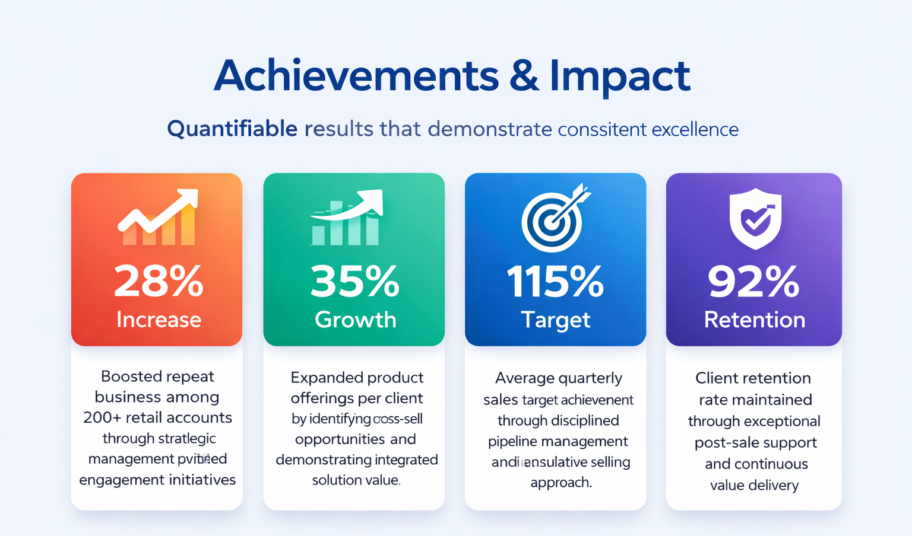

<html lang="en">
<head>
    <meta charset="UTF-8">
    <meta name="viewport" content="width=device-width, initial-scale=1.0">
    <title>Deborah Nyanchama | Digital Marketing Strategist</title>
    <link href="https://fonts.googleapis.com/css2?family=Playfair+Display:wght@400;600;700&family=Inter:wght@300;400;500;600;700&display=swap" rel="stylesheet">
    
</head>
<body>

    <!-- Navigation -->
    <nav>
        <ul>
            <li><a href="#cover">Home</a></li>
            <li><a href="#summary">Profile</a></li>
            <li><a href="#skills">Skills</a></li>
            <li><a href="#experience">Experience</a></li>
            <li><a href="#casestudy">Case Study</a></li>
            <li><a href="#process">Process</a></li>
            <li><a href="#achievements">Impact</a></li>
            <li><a href="#tools">Tools</a></li>
            <li><a href="#industry">Industry</a></li>
        </ul>
    </nav>
    <!-- Cover Section -->
    <section id="cover" class="cover-section">
        

            

            

            

        

        

            <h1>Deborah Nyanchama</h1>
            
Digital Marketing Specialist

            
Driving measurable growth through strategic prospecting, client acquisition, and digital advertising solutions. Transforming leads into lasting partnerships.

            

                

                    3+
                    Years Experience
                

                

                    200+
                    Retail Accounts
                

                

                    28%
                    Repeat Business Growth
                

            

        

    </section>

    <!-- Professional Summary -->
    <section id="summary" class="summary-section">
        

            <h2>Professional Summary</h2>
            
An overview of career achievements and value proposition

        

        

            

                
Results-driven <strong>B2B/B2C Sales Executive</strong> with 3 years of progressive experience in lead generation, client acquisition, and account management within the advertising industry. Proven track record of prospecting, negotiating, and closing high-value deals while maintaining exceptional client relationships.

                
                
Specialized in <strong>digital advertising solutions</strong>, I excel at translating complex marketing concepts into compelling value propositions that drive client success. My approach combines data-driven insights with personalized relationship building to deliver measurable ROI.

                
                

                    
"I don't just sell advertising space—I deliver growth engines that transform businesses and create lasting market impact."

                

                
                
Expert in leveraging CRM tools, digital marketing analytics, and market research to identify opportunities, optimize pipelines, and exceed sales targets consistently. Passionate about connecting brands with their ideal audiences through strategic advertising placement.

            

            

                
            

        

    </section>

    <!-- Core Skills -->
    <section id="skills" class="skills-section">
        

            <h2>Core Skills & Abilities</h2>
            
Comprehensive expertise across sales, technology, and relationship management

        

        

            

                
💼

                <h3>Hard Skills</h3>
                <ul class="skill-list">
                    <li>Digital Advertising Solutions</li>
                    <li>Print Media Sales</li>
                    <li>Account Management</li>
                    <li>CRM Systems & Pipeline Management</li>
                    <li>Market Research & Analysis</li>
                    <li>Sales Forecasting & Reporting</li>
                    <li>B2B Lead Generation</li>
                </ul>
            

            

                
🤝

                <h3>Soft Skills</h3>
                <ul class="skill-list">
                    <li>Strategic Negotiation</li>
                    <li>Executive Presentation</li>
                    <li>Customer Relationship Management</li>
                    <li>Consultative Selling</li>
                    <li>Cross-functional Collaboration</li>
                    <li>Problem Solving</li>
                    <li>Time Management</li>
                </ul>
            

            

                
⚡

                <h3>Technical Skills</h3>
                <ul class="skill-list">
                    <li>Meta Business Suite</li>
                    <li>Google Analytics</li>
                    <li>SEO/SEM Strategies</li>
                    <li>Zapier Automation</li>
                    <li>Statista Research</li>
                    <li>AI Tools (Manus, Claude)</li>
                    <li>Data Visualization</li>
                </ul>
            

        

    </section>

    <!-- Experience -->
    <section id="experience" class="experience-section">
        

            <h2>Professional Experience</h2>
            
Track record of securing partnerships and driving revenue growth

        

        

            

                

                    

                

                

                    B2B Sales Executive | Advertising Sector
                    <h3>Strategic Account Development</h3>
                    
Leading B2B sales initiatives focused on digital and print advertising solutions for diverse client portfolio.

                    <ul class="exp-achievements">
                        <li><strong>Client Acquisition:</strong> Prospected and secured partnerships with 50+ new B2B clients across retail, hospitality, and professional services sectors</li>
                        <li><strong>Revenue Growth:</strong> Consistently exceeded quarterly sales targets by average of 115% through strategic upselling and cross-selling initiatives</li>
                        <li><strong>Account Expansion:</strong> Increased average contract value by 35% through consultative needs analysis and tailored solution presentation</li>
                        <li><strong>Pipeline Management:</strong> Maintained active pipeline of 150+ qualified opportunities using CRM-driven forecasting and prioritization</li>
                    </ul>
                

            

            

                

                    

                

                

                    Digital Advertising Specialist
                    <h3>Integrated Media Solutions</h3>
                    
Specialized in creating comprehensive advertising campaigns combining traditional print and cutting-edge digital channels.

                    <ul class="exp-achievements">
                        <li><strong>Solution Architecture:</strong> Designed integrated marketing campaigns leveraging both print circulation (200K+ reach) and digital platforms</li>
                        <li><strong>ROI Optimization:</strong> Implemented tracking mechanisms that demonstrated 3:1 average return on ad spend for clients</li>
                        <li><strong>Product Innovation:</strong> Launched new digital advertising packages resulting in 40% increase in digital revenue stream</li>
                        <li><strong>Client Retention:</strong> Achieved 92% client retention rate through proactive account management and performance reviews</li>
                    </ul>
                

            

        

    </section>

    <!-- Case Study Section -->
    <section id="casestudy" class="casestudy-section">
        

            <h2>Case Study</h2>
            
A deep-dive into a real campaign — strategy, execution, and results

        

        <!-- Hero card -->
        

            
Case Study · 2023–2026

            <h3>From 0 to 135K — <em>Growing a Kenyan Retail Brand</em> Through Social Media</h3>
            
How I built Onestopshop F3's digital presence from scratch, scaling Instagram and TikTok into the brand's most powerful sales channels in Kenya's beauty and lifestyle market.

            

                Digital Strategy
                Content Marketing
                Paid Advertising
                Instagram
                TikTok
                Influencer Partnerships
                Brand Positioning
            

        

        <!-- Metrics -->
        

            

                135K+
                
Followers Gained

                
Instagram

            

            

                30K+
                
Followers Gained

                
TikTok

            

            

                177K+
                
Total Likes

                
TikTok Engagement

            

        

        <!-- Challenge -->
        

            <h4>The Challenge</h4>
            
Onestopshop F3 had a strong physical retail presence selling fragrance, skincare, and fashion accessories — but virtually no digital footprint. The goal was to build an online brand identity from the ground up, attract a loyal following in Kenya's competitive beauty and lifestyle space, and convert that audience into paying customers.

            

                
"We needed to show that affordable could still feel aspirational — and that Kenyan shoppers deserved a brand that spoke their language."

            

        

        <!-- Strategy cards -->
        

            

                <h4>Content Strategy</h4>
                
Built a consistent content calendar around trending audio, product showcases, and culturally relevant moments. Leaned into TikTok's discovery algorithm with original sounds and duet/stitch mechanics to maximise organic reach.

                

                    #affordablebagskenya
                    #corporatebags
                    Original Sounds
                    Trending Hashtags
                

            

            

                <h4>Influencer Partnerships</h4>
                
Identified and collaborated with mid-tier Kenyan lifestyle creators to extend reach authentically. Focused on creators whose audiences overlapped with the brand's target demographic in beauty and fashion.

                

                    Gifting Campaigns
                    Co-created Content
                    Reviews & Unboxing
                

            

            

                <h4>Paid Advertising</h4>
                
Managed targeted Meta and TikTok ad campaigns with continuous A/B testing on creatives. Used analytics to identify top-performing content and allocate budget toward proven formats to drive retail conversions.

                

                    Meta Ads
                    TikTok Ads
                    A/B Testing
                    ROI Tracking
                

            

            

                <h4>Community Engagement</h4>
                
Hosted TikTok Lives for product launches and flash sales. Ran giveaways and Instagram Stories polls to keep the audience interactive and invested in the brand's journey, boosting loyalty and repeat purchases.

                

                    TikTok Lives
                    Giveaways
                    IG Stories
                    Flash Sales
                

            

        

        <!-- Timeline -->
        

            <h4>Campaign Timeline</h4>
            

                
01

                

                    
Jan – Apr 2023

                    
Foundation & Brand Voice

                    
Established visual identity, content pillars, and posting cadence. Built initial audience through organic reach and a targeted hashtag strategy tailored to Kenyan retail shoppers.

                

            

            

                
02

                

                    
May 2023 – Mid 2024

                    
Growth Acceleration

                    
Launched influencer collaborations and scaled TikTok content output. First paid campaigns deployed with retargeting funnels to drive measurable store traffic and online enquiries.

                

            

            

                
03

                

                    
Late 2024 – Jan 2026

                    
Community & Conversion Focus

                    
Scaled TikTok Lives and giveaway campaigns. Optimised ad spend based on performance data, significantly boosting ROI and repeat purchase rates among existing customers.

                

            

        

        <!-- Takeaway with bar chart -->
        

            <h4>Key Results & Takeaway</h4>
            

                

                    Instagram
                    

                    135K
                

                

                    TikTok Followers
                    

                    30K
                

                

                    TikTok Likes
                    

                    177K
                

            

            
This project proved that a retail brand in an emerging market can compete and win on social media through consistent, authentic content — without a massive budget. The key was understanding the audience deeply, moving fast on trends, and treating every follower as a potential loyal customer rather than just a number.

        

    </section>

    <!-- Process of Work -->
    <section id="process" class="process-section">
        

            <h2>Process of Work</h2>
            
A systematic approach to converting prospects into loyal clients

        

        

            

                
1

                <h4>Prospecting</h4>
                
Market research and lead identification using data-driven targeting criteria

            

            

                
2

                <h4>Engagement</h4>
                
Strategic outreach via multi-channel approach with personalized messaging

            

            

                
3

                <h4>Discovery</h4>
                
In-depth needs analysis to understand client objectives and pain points

            

            

                
4

                <h4>Solution</h4>
                
Customized advertising proposals with clear ROI projections

            

            

                
5

                <h4>Closing</h4>
                
Strategic negotiation and seamless contract execution

            

            

                
6

                <h4>Retention</h4>
                
Ongoing relationship management and performance optimization

            

        

    </section>

    <!-- Achievements -->
    <section id="achievements" class="achievements-section">
        

            <h2>Achievements & Impact</h2>
            
Quantifiable results that demonstrate consistent excellence

        

        

            

                

                    <h3>28% Increase</h3>
                    
Boosted repeat business among 200+ retail accounts through strategic account management and proactive engagement initiatives

                

                

                    <h3>35% Growth</h3>
                    
Expanded product offerings per client by identifying cross-sell opportunities and demonstrating integrated solution value

                

                

                    <h3>115% Target</h3>
                    
Average quarterly sales target achievement through disciplined pipeline management and consultative selling approach

                

                

                    <h3>92% Retention</h3>
                    
Client retention rate maintained through exceptional post-sale support and continuous value delivery

                

            

            

                
            

        

    </section>

    <!-- Tools -->
    <section id="tools" class="tools-section">
        

            <h2>Technology Stack</h2>
            
Advanced tools that power sales excellence and client insights

        

        

            

                
M

                <h4>Meta Business Suite</h4>
                
Social media advertising management and campaign optimization

            

            

                
G

                <h4>Google Analytics</h4>
                
Web traffic analysis and conversion tracking

            

            

                
S

                <h4>SEO/SEM</h4>
                
Search engine optimization and paid search management

            

            

                
Z

                <h4>Zapier</h4>
                
Workflow automation and CRM integration

            

            

                
St

                <h4>Statista</h4>
                
Market research and industry data analysis

            

            

                
Ma

                <h4>Manus</h4>
                
AI-powered research and automation

            

            

                
Cl

                <h4>Claude</h4>
                
AI assistant for content and strategy

            

            

                
CRM

                <h4>CRM Systems</h4>
                
Pipeline management and client tracking

            

        

        
        

            

                
            

            

                
            

        

    </section>

    <!-- Industry Exposure -->
    <section id="industry" class="industry-section">
        

            <h2 style="color: white;">Industry Exposure</h2>
            
Global networking and cross-industry insights

        

        

            

                <h3>Beauty World Expo 2025</h3>
                
Participated in one of the industry's premier international exhibitions, gaining invaluable exposure to global market trends and emerging consumer behaviors.

                
This experience expanded my understanding of cross-industry advertising needs and reinforced the importance of culturally-aware marketing strategies in today's globalized marketplace.

                
                <ul class="industry-highlights">
                    <li>Networked with 100+ international suppliers and potential clients from 30+ countries</li>
                    <li>Gained insights into beauty industry advertising trends and digital transformation</li>
                    <li>Established connections with key decision-makers in retail and distribution</li>
                    <li>Observed emerging marketing technologies and their application in B2B/B2C contexts</li>
                    <li>Developed understanding of cross-cultural business communication nuances</li>
                </ul>
            

            

                
            

            

                
            
    
        

    </section>

    <!-- Contact CTA -->
    <section class="contact-section">
        <h2>Ready to Drive Growth Together?</h2>
        
Let's discuss how strategic advertising solutions can transform your business outcomes

        <a href="mailto:deborahnyanchama744@gmail.com" class="cta-button">Get In Touch</a>
        
deborahnyanchama744@gmail.com

    </section>

    <!-- Footer -->
    <footer>
        
&copy; 2025 Deborah Nyanchama. Professional Portfolio. All rights reserved.

    </footer>

    

</body>
</html>
